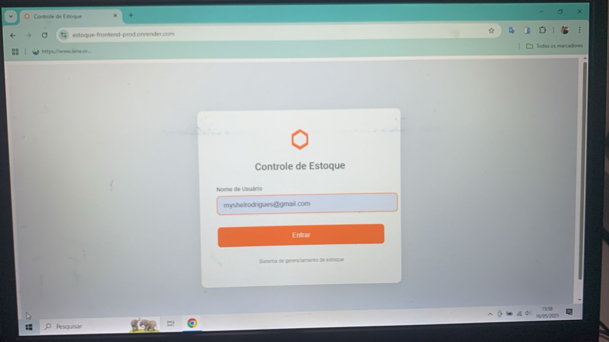
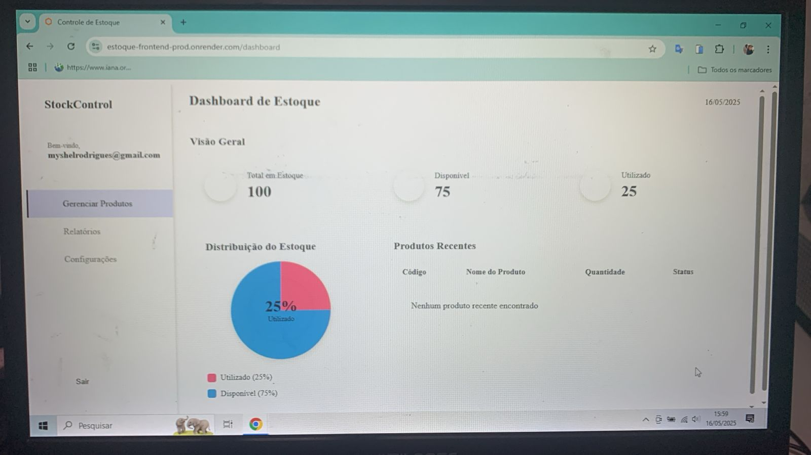
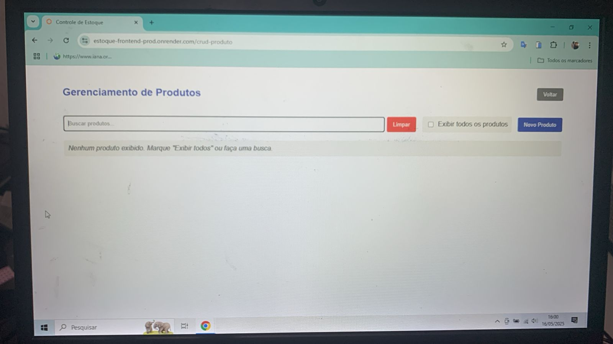
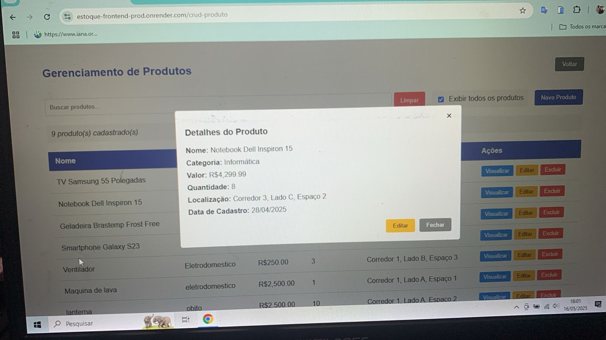
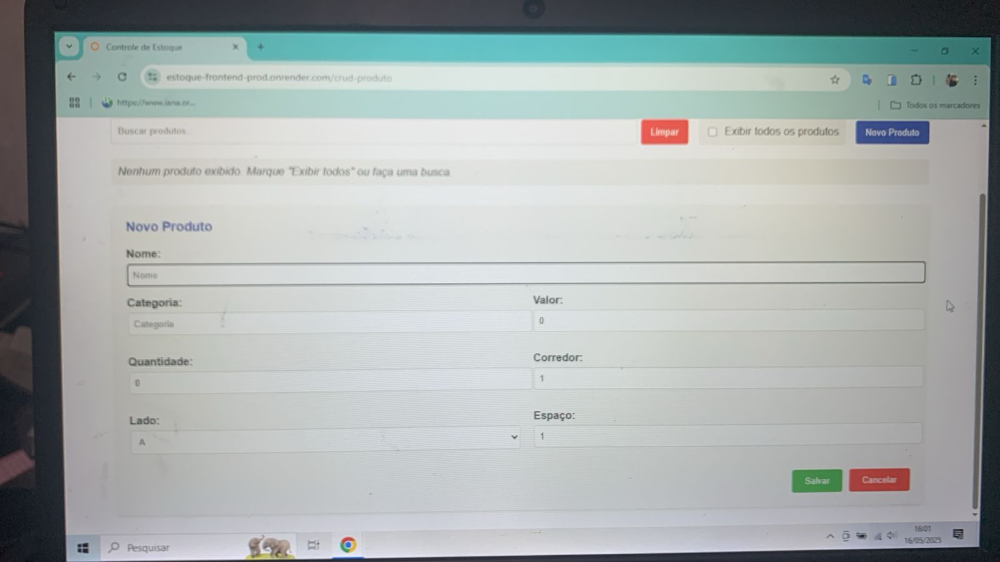
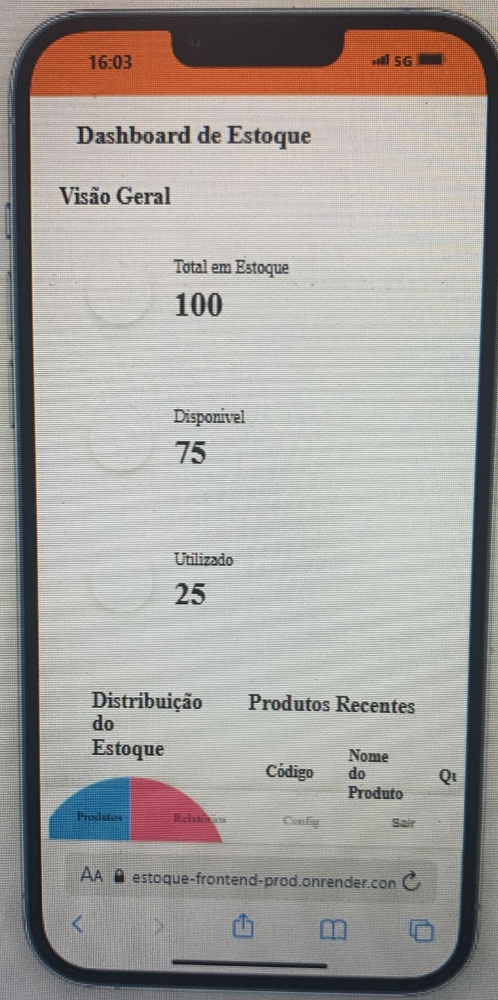
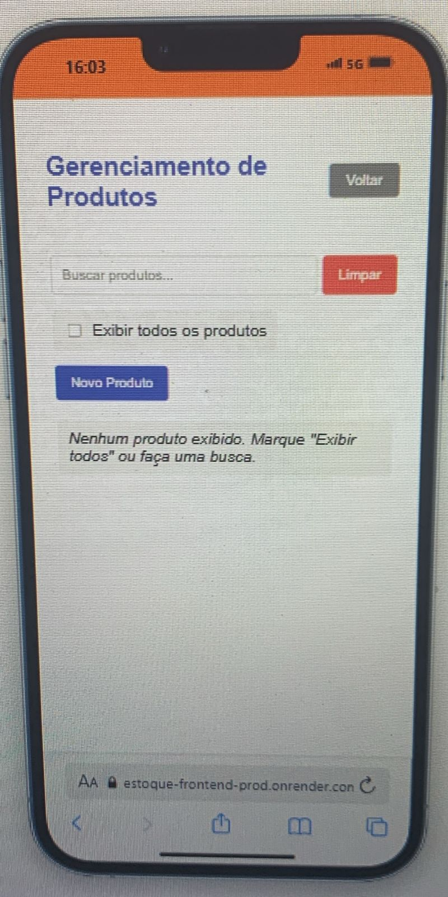
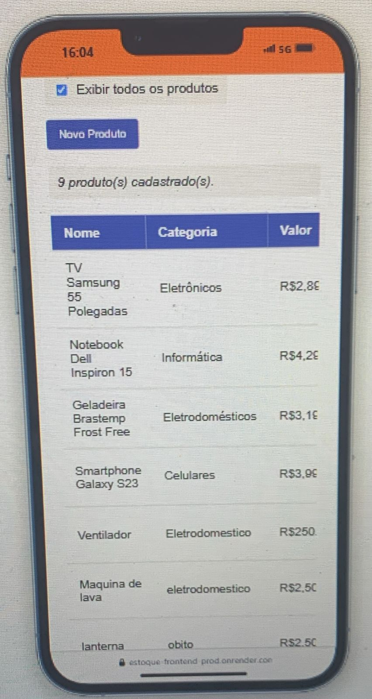

# 📦 Sistema de Controle de Estoque - Michael Rodrigues

🚀 **Deploy:** [estoque-frontend-prod.onrender.com](https://estoque-frontend-prod.onrender.com/)  
🐳 **DockerHub:** [myshelrodrigues189](https://hub.docker.com/repositories/myshelrodrigues189)  
🔗 **LinkedIn:** [Michael Rodrigues](https://www.linkedin.com/in/michael-rodrigues-b741a1104/)  
📂 **Repositório:** [GitHub - Controle_De_Estoque](https://github.com/Michaelrodriguesds/Controle_De_Estoque)

---

## ✨ Sobre o Projeto

Sistema Web responsivo para **gerenciamento de estoque**, criado com:

- 💻 **Frontend:** Angular 16 + SCSS (totalmente responsivo)
- ⚙️ **Backend:** C# (.NET) com MongoDB Atlas
- 🐳 **Dockerizado:** Docker + Docker Compose
- ☁️ **Deploy:** Render + DockerHub

### Funcionalidades Principais

✅ Login (sem senha, apenas para portfólio)  
📊 Dashboard com status geral do estoque em gráfico de pizza  
📦 Visualização do último produto adicionado, com **quantidade** e **status (normal, baixo ou alto)**  
➕ Adicionar produto  
✏️ Editar produto  
❌ Excluir produto  
🔍 Filtrar por **nome**, **categoria** ou visualizar **todos os produtos**  
📍 Mostrar localização correta do item: **Corredor 1, Lado A, Espaços de 1 a 10**  
🚫 Validação de espaço: não permite adicionar produto em local já ocupado

---

## 🧠 Desafios Técnicos Superados

- Integração entre Angular, .NET e MongoDB Atlas em nuvem  
- Controle de espaço físico virtual (validação de localização ocupada)  
- Dockerização completa com `docker-compose`  
- Upload para DockerHub com imagens separadas para backend e frontend  
- Deploy via Render com containers interligados  
- Criação de UI responsiva e intuitiva, ideal para celular ou desktop  

---

## 🛠️ Tecnologias Utilizadas

- Angular 16
- SCSS
- C# (.NET 6)
- MongoDB Atlas
- Docker / Docker Compose
- Render
- DockerHub

---

## 📸 Demonstrações do Projeto

As imagens abaixo mostram o funcionamento real da aplicação em diferentes telas e dispositivos:

| Login PC | Status Estoque | Busca Produto | Detalhe Produto |
|---|---|---|---|
|  |  |  |  |

| Adiciona Produto | Status Mobile | Busca Mobile | Produto Mobile |
|---|---|---|---|
|  |  |  |  |

---

## 🐳 Rodando com Docker Compose

```bash
# Clone o repositório
git clone https://github.com/Michaelrodriguesds/Controle_De_Estoque.git
cd Controle_De_Estoque

# Rode os containers
docker-compose up --build
